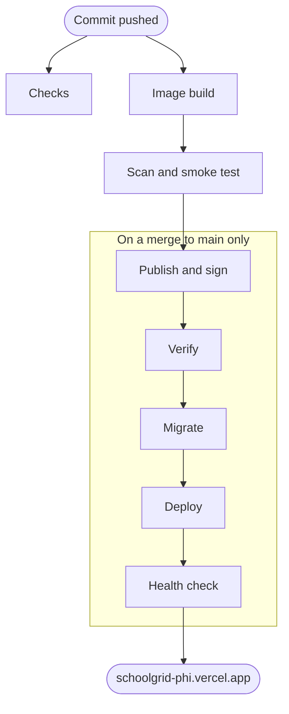

# SchoolGrid

Unified digital infrastructure for school administration, course management, and student performance tracking.

Built as a practice ground for DevSecOps. The domain is deliberately security-heavy: every record belongs to exactly one School, access derives from scoped relationships rather than from credentials, and every refusal is designed to leak nothing about what exists. The security properties are in the domain, not bolted on afterwards.

## Security pipeline

Live at **<https://schoolgrid-phi.vercel.app>**, running the current `main`. The sign-in page offers a one-click sign-in as a School Administrator, as Faculty, as a Student and as a Guardian, and the ["How this was built" page](https://schoolgrid-phi.vercel.app/how-this-was-built) shows the commit and image digest the site is serving, with the command to verify them yourself.

Nothing reaches that URL by hand. A commit takes the path below, and from the image build onwards each step has to pass before the next one runs.



Each box above is a row below, under the same name, with what it stops and a link to the workflow job or script that does it. An image is named throughout by its **digest**, the hash of its bytes: unlike a tag, it cannot be moved to point at something else later.

| Step | What it prevents | Where it runs |
| --- | --- | --- |
| **Checks** | Code that does not compile, does not pass its tests, trips a CodeQL query (GitHub's own scanner for insecure code), brings in a dependency that is vulnerable or carries a licence this project cannot honour (that one on pull requests, while the dependency is still only proposed), or carries a credential anywhere in its history. Each is its own workflow, running beside the image build rather than ahead of it. | [`ci.yml`](.github/workflows/ci.yml) (_Typecheck, build and test_), [`codeql.yml`](.github/workflows/codeql.yml), [`dependency-review.yml`](.github/workflows/dependency-review.yml), [`secret-scan.yml`](.github/workflows/secret-scan.yml) |
| **Image build** | A runtime image carrying anything an intruder could use once inside it — a shell, a package manager, a dev dependency, a root user, the web app's sources, or the demo's published sign-ins — checked against the image that came out, not the recipe that went in. | [`container.yml`](.github/workflows/container.yml) (_Container build_) |
| **Scan and smoke test** | An image with a known vulnerability, or one that cannot start and serve a real browser: it is run against a real PostgreSQL and driven by the browser suite before anything may publish it. | [`container.yml`](.github/workflows/container.yml) (_Trivy image scan_, _Container smoke test_), [`scripts/smoke-test.sh`](scripts/smoke-test.sh) |
| **Publish and sign** | An image reaching the registry unreviewed, or something else later passing itself off as one of ours: only a merge to `main` publishes, only that one job holds a token that can push, and each image is signed by the workflow's own identity rather than by a key someone could steal. | [`container.yml`](.github/workflows/container.yml) (_Publish to GHCR_, _Attest provenance and SBOM_), [`scripts/publish-image.sh`](scripts/publish-image.sh) |
| **Verify** | A published image that is private, unrunnable, or not the one this repository built: a fresh runner holding no credentials pulls it, boots it, and checks its signatures exactly as an outsider would. | [`container.yml`](.github/workflows/container.yml) (_Pull and boot the published image anonymously_, _Verify the attestations as a consumer would_), [`scripts/verify-image.sh`](scripts/verify-image.sh) |
| **Migrate** | The running service ever holding the credentials that could alter the schema or an Audit record: the database is migrated here, by that same verified image, from the one job that holds the owner's connection string ([docs/database-roles.md](docs/database-roles.md)). | [`container.yml`](.github/workflows/container.yml) (_Verify, migrate and deploy to production_), [`scripts/deploy.sh`](scripts/deploy.sh) |
| **Deploy** | Production running different bytes from the ones just verified: Vercel is handed a one-line `Dockerfile` pinning that exact digest and none of this repository's source, so it has nothing to rebuild from ([ADR-0005](docs/adr/0005-production-runs-the-verified-image.md)). | [`container.yml`](.github/workflows/container.yml) (_Verify, migrate and deploy to production_), [`scripts/deploy.sh`](scripts/deploy.sh) |
| **Health check** | A broken deploy going unnoticed: once the deploy is live, `/api/health` is retried until it answers `200`, and the job fails loudly if it never does. | [`container.yml`](.github/workflows/container.yml) (_Verify, migrate and deploy to production_), [`scripts/deploy.sh`](scripts/deploy.sh) |

That is the whole path, in summary. The detail behind it is further down: [Security controls](#security-controls) for what each control catches, and [Published images](#published-images) for pulling an image and verifying it yourself.

### What the demo is not

- It runs on Vercel's free **Hobby plan**, for non-commercial personal use. It scales to zero when nobody is using it, so the first request after a quiet spell waits for the function and the database to wake.
- The data is **invented**. No real Student, Guardian or School record is on it, and nothing you type into it should be real either.
- The demo is **reset every night**, dropped and reseeded from [`demo/seed.sql`](demo/seed.sql) ([`demo-reset.yml`](.github/workflows/demo-reset.yml)). Changes you make are temporary, and changes you find were made by someone else. This nightly drop is the one exception to Audit records being append-only; everywhere else, they are.
- The **rate limit is counted per instance**, in memory. Vercel may run several at once, which multiplies the limit by however many are up.

## Status

The service boots, connects to Postgres and answers a health endpoint, and the test harness is in place. User accounts can authenticate, carry a session across requests, and end it (`POST`, `GET` and `DELETE /api/session`). A browser holds its session in a cookie; a client that sends `"session": "bearer"` with its credentials gets a Bearer token instead. No School-scoped behaviour yet.

A web app in `web/` (React, Vite, TypeScript) is built into the image and served by the service on every path outside `/api`, on the same origin. It signs in with the cookie session, lists the Schools the account reaches, and signs out.

## Running it

```bash
npm install       # runs only the install scripts allowlisted in package.json
npm test          # starts a real PostgreSQL; no Docker required
npm run typecheck
```

`npm test` needs no database of your own. The suite downloads and runs a genuine PostgreSQL binary, migrates a template database once, and hands every test its own copy of it. Tests are therefore isolated, and the guarantees under test are real database guarantees rather than a fake's approximation of them.

To run the service itself you need PostgreSQL 18 or newer (see [docs/database-roles.md](docs/database-roles.md#setting-up-a-database) for why). Copy `.env.example` to `.env`, create the application's database role as described in [docs/database-roles.md](docs/database-roles.md), point `MIGRATION_DATABASE_URL` at the schema owner and `DATABASE_URL` at that role, then `npm run dev`. Migrations are applied on startup, as the owner. Without `MIGRATION_DATABASE_URL`, as in production, the service migrates nothing and refuses to start unless the database is already fully migrated. The service refuses to start if `DATABASE_URL` could alter an Audit record.

`npm run build` compiles the service and builds the web app into `web/dist`, which `npm start` then serves. To work on the web app with reloading instead, run `npm run dev:web` beside `npm run dev` and open Vite's address: Vite proxies `/api` to the service, so set `PUBLIC_ORIGIN` to Vite's origin.

`npm run test:browser` runs the Playwright suite against a SchoolGrid already running at `SCHOOLGRID_ORIGIN` (default `http://localhost:3000`), arranging its fixtures through `SCHOOLGRID_DATABASE_URL`, the application's database login. Install its browser once with `npx playwright install chromium`. In CI it runs against the image built for the pull request, once the smoke test has passed it (`scripts/smoke-test.sh <image> npx playwright test`).

## Branches

`main` is the trunk and the default branch. `dev` is the integration branch; feature branches merge into `dev`, which is promoted to `main` at release.

## Where things live

| Path | What it holds |
| --- | --- |
| `CONTEXT.md` | The domain glossary. The authority on vocabulary — use its terms, avoid the ones it lists under `_Avoid_`. |
| `docs/adr/` | Architecture decision records. Read the ones covering an area before changing it. |
| `docs/agents/` | Conventions for agents working in this repo. |
| `docs/deployment.md` | The one-time setup of the public demo on Vercel and Neon. |
| `.scratch/<feature>/` | Specs and implementation tickets, one directory per feature. |
| `migrations/` | Plain SQL, applied in filename order. Never edit an applied migration; add a new one. Production is migrated before the new code serves, so every migration must stay compatible with the code one deploy behind it: expand first (add the column, table or permission), and contract (drop what the old code still reads) only in a later deploy. |

## Decisions worth knowing before reading the code

Three choices are load-bearing and will look wrong without their context:

- **[ADR-0001](docs/adr/0001-school-scoped-person-identity.md)** — no domain object spans Schools. There is no shared identity, no district rollup, and a departing Student's records travel nowhere.
- **[ADR-0002](docs/adr/0002-uniform-safe-denial.md)** — every refusal returns an identical response. Absent, cross-School, and forbidden are indistinguishable to the caller by design; the real reason goes only to the audit trail. Its addendum scopes this: a response may vary with the caller's own request but never with what exists, so throttling keeps its own `429`.
- **[ADR-0003](docs/adr/0003-per-student-publication-semantics.md)** — publication is an irreversible per-Student fact reached through a per-offering act.

## Testing approach

Behaviour a caller can observe has exactly one seam: the HTTP request boundary. Every such test issues a request through the client returned by the test harness and asserts on the response a caller would receive.

This is deliberate. ADR-0002 guarantees that two refusals are indistinguishable *to the caller*, and that is only assertable where a caller actually stands. A test below HTTP can confirm a denial happened; it cannot confirm that a cross-School denial and an absent-record denial look the same. Please do not add a second seam for convenience.

The rule governs what a caller can observe, so three kinds of test sit outside it, and nothing else should:

- **Startup configuration.** `loadConfig` runs before any caller exists, and a bad value must stop the process rather than surface in a response (`tests/config.test.ts`).
- **Database guarantees no caller can see.** Migration integrity, schema shape, and what is stored in place of a credential are asserted against the database directly (`tests/migrations.test.ts`, parts of `tests/authentication.test.ts`).
- **Repository tooling.** Scripts under `scripts/` are not the service and are tested as the programs they are.

The one other seam is a real browser against the built image (`e2e/`). It covers only what a browser alone can show: that the cookie, the Content Security Policy and same-origin serving work together. Domain behaviour is not tested again through the page, and there are no component tests.

## Contributing

Commit messages follow [Conventional Commits](https://www.conventionalcommits.org/). The allowed types are `feat`, `fix`, `docs`, `style`, `refactor`, `perf`, `test`, `chore` and `ci`. A title reads `type(optional scope): subject`, with `!` before the colon for a breaking change. Keep subjects short and imperative.

Pull request titles follow the same convention and are checked by the commit lint workflow when a pull request is opened, edited or pushed to. The title is the target rather than the branch's own commits because merges are squash-only: the title becomes the commit subject on the trunk, and the branch's commits are discarded by the squash.

The check reports its verdict in the workflow job summary and never fails. It guards a convention rather than a property of the software, so it must not be the thing standing between a security fix and `main`. Fix the title and the next run agrees.

## Security controls

| Control | What it catches |
| --- | --- |
| In-process rate limit on every route, per client address | A flood of requests turning into database round trips and exhausting the connection pool. Unknown routes count too, so probing for paths is not free. The web app's page and static assets do not count: they are served from memory, and one page load fetches several of them. Over the limit a client gets `429 {"status":"rate_limited"}` with `Retry-After`. Set with `RATE_LIMIT_MAX` and `RATE_LIMIT_WINDOW_MS` (default 100 per minute). Counts are held per instance, so running several instances multiplies the limit. Behind a reverse proxy every client shares the proxy's address; set `CLIENT_ADDRESS_HEADER` to the header the proxy puts the client's address in (on Vercel, `x-vercel-forwarded-for`) and the limit keys on that instead, falling back to the socket address for a request without it. Set it only behind a proxy that overwrites that header: anywhere else, any caller can send it and choose their own rate-limit key. |
| Browser sessions in a `__Host-` cookie that is `Secure`, `HttpOnly` and `SameSite=Strict` ([ADR-0004](docs/adr/0004-browser-sessions-in-httponly-cookies.md)) | Script injected into a page stealing the session: the token is never in a response body a browser asked for. A change (`POST`, `PATCH`, `DELETE`) made with the cookie must carry an `Origin` equal to `PUBLIC_ORIGIN`, so another site cannot make one as the signed-in user. A sign-in is only given the cookie under the same rule, so another site cannot sign the browser in as someone else. A request presenting both a cookie and a Bearer token is refused. Every such refusal is the one refusal, and inside a School its true reason is audited. |
| Gitleaks, full history, on push and weekly | Credentials committed at any point, not just at the tip. The public demo's passwords are the one allowed exception, listed by exact value in `.gitleaks.toml`, never by file, so a real secret beside them is still caught. |
| GitHub secret scanning with push protection | Blocks a credential at `git push`, before it reaches the remote. |
| Dependency review on pull requests | Vulnerable or copyleft-licensed dependencies entering through a PR. |
| `allowScripts` in `package.json` | Install-time code execution. Scripts run only for exact allowlisted versions, so a new one needs a visible change here. |
| Distroless runtime image, built on every pull request | A shell, a package manager, a dev dependency or a root user reaching the runtime image. The web app ships as its static build output alone, never its sources or build toolchain. The public demo's seed, which creates accounts with published passwords, never ships in it. The properties are asserted against the built artifact, not against the Dockerfile. |
| Browser tests against the image built for each pull request | A page that breaks under the Content Security Policy, a session that page script can read, or a change another site can make as the signed-in user. Every page the suite opens must report no CSP violation. |
| Trivy scan of the lockfile, dev dependencies included | A vulnerable package bundled into the web app. The bundle ships inside the image, but the packages it was built from do not appear there as packages, so the image scan cannot see them. |
| Publication to GHCR from `main` only, after the scan, smoke test and browser tests | An unreviewed, vulnerable or unstartable image reaching the registry. Pull requests build and check the image but never push it, and only the publishing job holds a token that can. |
| Images tagged by full commit SHA | A running image that cannot be traced back to its source. `latest` moves only to the current head of `main`, never backwards to an older merge. |
| Anonymous pull and boot after every publish | A package that is private, or a push that did not produce a runnable image. The check runs on a fresh runner with no registry credentials. |
| Keyless SLSA build provenance and SBOM attestations on every published image | An image pushed to the registry by anything other than this repository's container workflow building a commit on `main`. Signed with the workflow's OIDC identity, so there is no signing key to leak; only the attesting job can request that identity. Verified after every publish with the same command a consumer runs. |

## Published images

Every merge to `main` publishes `ghcr.io/aszeffs/schoolgrid`, tagged with the full commit SHA and `latest`. The package is public and needs no login:

```bash
docker pull ghcr.io/aszeffs/schoolgrid:<full-commit-sha>
```

Prefer the commit tag. `latest` tells you what is newest, not what you are running.

The package is public so that anyone, not only the maintainer, can verify where an image came from. Nothing sets that by hand: the image carries an `org.opencontainers.image.source` label pointing at this repository and is pushed with the workflow's own token, so GHCR links the package to the repository and gives it the repository's public visibility. A package can still be made private from its settings, independently of the repository, and the anonymous pull job after every publish is what would catch that.

The running site says which image it is: `GET /api/build-info` returns the commit the image was built from, baked in as the `BUILD_COMMIT` build argument, and the digest it was deployed as, which the deploy supplies as `IMAGE_DIGEST` because an image cannot carry its own digest. Either is left out when unknown, as both are in local development. The web app's "How this was built" page, linked from the sign-in page, shows both with the command below filled in.

### Verifying an image

Every published image carries two signed attestations, stored both with GitHub and beside the image in the registry: SLSA build provenance, recording the workflow, commit and ref that built it, and an SPDX SBOM listing what is inside. They are signed through Sigstore with the build workflow's own identity, so there is no public key to fetch; the identity is what you check.

You need the [GitHub CLI](https://cli.github.com/) logged in to any GitHub account. You do not need access to anything beyond this public repository. Name the image by digest, so the check covers the bytes you will run rather than whatever a tag points at by then:

```bash
IMAGE=ghcr.io/aszeffs/schoolgrid
DIGEST="$(docker buildx imagetools inspect "$IMAGE:<full-commit-sha>" --format '{{.Manifest.Digest}}')"

gh attestation verify "oci://$IMAGE@$DIGEST" \
  --repo aszeffs/SchoolGrid \
  --signer-workflow aszeffs/SchoolGrid/.github/workflows/container.yml \
  --source-ref refs/heads/main \
  --source-digest <full-commit-sha> \
  --deny-self-hosted-runners
```

A pass means this repository's container workflow, running on a GitHub-hosted runner, built that exact digest from that commit on `main`. Drop `--source-digest` to accept any commit from `main`. `--repo` alone is weaker than it looks: it accepts a statement signed by *any* workflow in the repository, which is why `--signer-workflow` is there. Add `--bundle-from-oci` to read the attestations from the registry instead of from GitHub. Then pull by that digest, `docker pull "$IMAGE@$DIGEST"`, rather than by the tag, which may have moved since you checked.

To check the SBOM, and read it without pulling the image:

```bash
gh attestation verify "oci://$IMAGE@$DIGEST" \
  --repo aszeffs/SchoolGrid \
  --signer-workflow aszeffs/SchoolGrid/.github/workflows/container.yml \
  --source-ref refs/heads/main \
  --source-digest <full-commit-sha> \
  --deny-self-hosted-runners \
  --predicate-type https://spdx.dev/Document/v2.3 \
  --format json --jq '.[0].verificationResult.statement.predicate' > sbom.spdx.json
```

The SBOM is generated by Trivy from the exact image the scan passed, before it is pushed.
